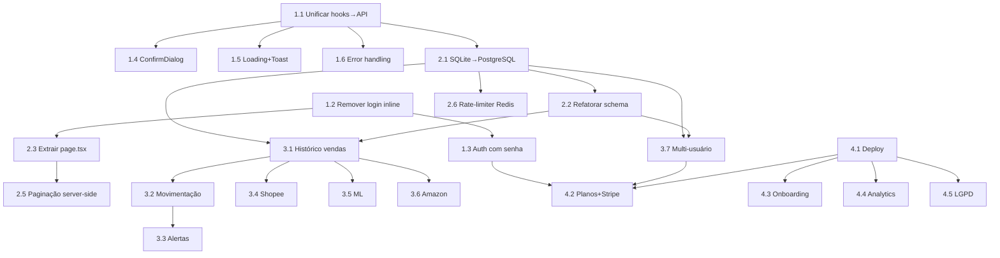

# ROADMAP — Controle de Estoque para Lojas

> Com base no PROJECT_AUDIT.md (08/06/2026)
> Versão atual: 0.2.0 → Versão alvo: 1.0.0

---

## Visão Geral das Fases

| Fase | Foco | Duração estimada | Resultado |
|------|------|------------------|-----------|
| **FASE 1** | Correções críticas | 2–3 semanas | Produto utilizável com dados seguros |
| **FASE 2** | Profissionalização | 3–4 semanas | Arquitetura robusta, pronta para escala |
| **FASE 3** | Funcionalidades avançadas | 4–6 semanas | Diferenciais competitivos reais |
| **FASE 4** | Produto comercializável | 2–3 semanas | SaaS no ar, cobrando, com usuários |

> **Total estimado:** 11–16 semanas (~3–4 meses)

---

## FASE 1 — Correções Críticas
*"Parar de perder dados e começar a funcionar direito"*

### 1.1 — Unificar persistência: hooks → API
| Campo | Detalhe |
|-------|---------|
| **Problema** | `useProducts()` e `useCategories()` usam apenas localStorage. APIs completas (Prisma, Zod, auditoria) existem mas não são chamadas. |
| **Solução** | Reescrever hooks para chamar API REST como fonte primária, localStorage como cache offline. |
| **Esforço** | ⚡⚡⚡⚡ (4/5) — Médio-alto. Afeta ProductForm, ProductTable, CategoryManager, page.tsx. |
| **Dependências** | Nenhuma. Pode ser feito agora. |
| **Tarefas** | • Criar serviço `lib/api.ts` com funções `fetchProducts`, `createProduct`, `updateProduct`, `deleteProduct`<br>• Reescrever `useProducts` para chamar API, fallback para localStorage se offline<br>• Reescrever `useCategories` para chamar API (`GET /api/products/categories`?)<br>• Adicionar loading states e error handling em todos os componentes que consomem esses hooks<br>• Remover `storage.ts` ou reduzir a cache-only |

### 1.2 — Remover login inline da page.tsx
| Campo | Detalhe |
|-------|---------|
| **Problema** | `app/page.tsx` renderiza formulário de login próprio quando desautenticado. Rota `/login` separada também existe. Código duplicado. |
| **Solução** | Redirecionar para `/login` quando não autenticado. Manter apenas a rota dedicada. |
| **Esforço** | ⚡ (1/5) — Simples. |
| **Dependências** | Nenhuma. |
| **Tarefas** | • Extrair `LoginForm` como componente compartilhado<br>• page.tsx passa a redirecionar via `redirect('/login')` em vez de renderizar form<br>• Remover lógica de login duplicada de page.tsx |

### 1.3 — Adicionar autenticação real com senha
| Campo | Detalhe |
|-------|---------|
| **Problema** | Login apenas com email, sem senha. Qualquer email existente acessa a conta. |
| **Solução** | Adicionar senha obrigatória no cadastro/login. NextAuth credentials com hash bcrypt. |
| **Esforço** | ⚡⚡⚡ (3/5) — Médio. Requer alterar schema do User + fluxo de auth. |
| **Dependências** | • 1.2 (LoginForm extraído) |
| **Tarefas** | • Adicionar `passwordHash` ao modelo User no Prisma<br>• Criar migration<br>• Implementar bcrypt hash no cadastro<br>• Implementar verificação no login<br>• Adicionar página de cadastro (`/register`)<br>• Rate-limit na rota de login |

### 1.4 — ConfirmDialog na exclusão de produtos
| Campo | Detalhe |
|-------|---------|
| **Problema** | Excluir produto não tem confirmação. Categoria e fornecedor têm (ConfirmDialog). Inconsistente. |
| **Solução** | Adicionar ConfirmDialog antes de deletar produto. |
| **Esforço** | ⚡ (1/5) — Fácil. |
| **Dependências** | • 1.1 (hooks usando API) |
| **Tarefas** | • Envolver exclusão em ConfirmDialog<br>• Usar `product.name` no título |

### 1.5 — Loading states + Toast feedback no CRUD
| Campo | Detalhe |
|-------|---------|
| **Problema** | Sem spinner/disabled em formulários. Sem toast de sucesso/erro. Usuário sem feedback. |
| **Solução** | Desabilitar botão durante submit + mostrar toast. |
| **Esforço** | ⚡⚡ (2/5) — Baixo-médio. |
| **Dependências** | • 1.1 (hooks usando API) |
| **Tarefas** | • Adicionar estado `submitting` no ProductForm<br>• Desabilitar botão + mostrar spinner durante submit<br>• Chamar `toast()` com sucesso/erro após cada operação |

### 1.6 — Tratamento de erro HTTP consistente
| Campo | Detalhe |
|-------|---------|
| **Problema** | `useSuppliers` só faz `res.ok`. Sem fallback, retry, ou feedback. |
| **Solução** | Implementar error handling padronizado em todas as chamadas API. |
| **Esforço** | ⚡⚡ (2/5) |
| **Dependências** | • 1.1 (cria `lib/api.ts`) |
| **Tarefas** | • Criar wrapper `apiRequest()` que lida com erros, timeout, retry<br>• Unificar tratamento em todos os hooks |

---

## FASE 2 — Profissionalização
*"Arquitetura pronta para produção"*

### 2.1 — Migrar SQLite → PostgreSQL
| Campo | Detalhe |
|-------|---------|
| **Problema** | SQLite não suporta concorrência. Falha com múltiplos usuários simultâneos. |
| **Solução** | Migrar para PostgreSQL (Supabase, Neon ou Railway). |
| **Esforço** | ⚡⚡⚡⚡ (4/5) — Alto. Requer mudar provider, adaptar schema, migrar dados. |
| **Dependências** | • 1.1 (dados product/category agora na API) |
| **Tarefas** | • Mudar `provider = "postgresql"` no schema<br>• Ajustar tipos (Float → Decimal, String IDs, etc.)<br>• Criar migration inicial<br>• Configurar conexão via variável de ambiente<br>• Migrar dados do SQLite local para PostgreSQL<br>• Testar todas as queries |

### 2.2 — Refatorar schema do banco
| Campo | Detalhe |
|-------|---------|
| **Problema** | Float para preço (precisão), SKU sem unique, sem soft delete, sem índices. |
| **Solução** | Aplicar correções de schema. |
| **Esforço** | ⚡⚡⚡ (3/5) |
| **Dependências** | • 2.1 (aproveitar a migração para PostgreSQL) |
| **Tarefas** | • Mudar `price` para `Decimal(10,2)` ou `Int` (centavos)<br>• Adicionar `@@unique([sku, userId])`<br>• Adicionar `deletedAt` nullable<br>• Adicionar índices em `name`, `sku`, `category`, `marketplace`, `createdAt` |

### 2.3 — Extrair page.tsx monolítico em componentes
| Campo | Detalhe |
|-------|---------|
| **Problema** | page.tsx com ~400 linhas misturando auth, dashboard, CRUD, etc. |
| **Solução** | Extrair seções em componentes dedicados. |
| **Esforço** | ⚡⚡ (2/5) |
| **Dependências** | • 1.2 (login removido de page.tsx) |
| **Tarefas** | • Criar `DashboardMetrics` (cards)<br>• Criar `ProductSection` (tabela + formulário)<br>• Criar `CategorySection`<br>• Criar `SupplierSection`<br>• page.tsx vira um layout que importa esses componentes |

### 2.4 — Sidebar overlay em mobile
| Campo | Detalhe |
|-------|---------|
| **Problema** | Sidebar fixa de 240px (ou 64px collapsed) em mobile. |
| **Solução** | Sidebar vira overlay/drawer em < 768px, com backdrop. |
| **Esforço** | ⚡⚡ (2/5) |
| **Dependências** | Nenhuma. |
| **Tarefas** | • Detectar viewport com `useMediaQuery`<br>• Sidebar como drawer com `transform: translateX`<br>• Backdrop semi-transparente ao abrir |

### 2.5 — Paginação server-side no ProductTable
| Campo | Detalhe |
|-------|---------|
| **Problema** | ProductTable carrega TODOS os produtos em memória e fatia no frontend. |
| **Solução** | Conectar à API com paginação server-side (via `?page=&pageSize=`). |
| **Esforço** | ⚡⚡⚡ (3/5) |
| **Dependências** | • 1.1 (hooks usando API)<br>• 2.3 (ProductSection extraído) |
| **Tarefas** | • Adaptar `useProducts` para aceitar paginação<br>• ProductTable passa `page` e `pageSize` para a API<br>• API já suporta paginação — só conectar |

### 2.6 — Rate-limiter com Redis
| Campo | Detalhe |
|-------|---------|
| **Problema** | Rate-limiter em Map na memória. Não funciona em multi-instância. |
| **Solução** | Substituir por Redis (Upstash ou Redis próprio). |
| **Esforço** | ⚡⚡ (2/5) |
| **Dependências** | • 2.1 (infraestrutura definida) |
| **Tarefas** | • Substituir `Map` por chamada Redis<br>• Manter mesma interface (`checkRateLimit`) |

### 2.7 — Acessibilidade: `prefers-reduced-motion` + foco visível
| Campo | Detalhe |
|-------|---------|
| **Solução** | Adicionar suporte a `prefers-reduced-motion`. Garantir `focus:ring` em selects. |
| **Esforço** | ⚡ (1/5) |
| **Dependências** | Nenhuma. |
| **Tarefas** | • Adicionar `@media (prefers-reduced-motion: reduce)` no globals.css<br>• Adicionar `focus:ring` nos elementos `<select>` |

### 2.8 — Auditoria com logging visível
| Campo | Detalhe |
|-------|---------|
| **Problema** | `createAuditLog` engole erros silenciosamente. |
| **Solução** | Logar erro no console do servidor em vez de engolir. |
| **Esforço** | ⚡ (1/5) |
| **Dependências** | Nenhuma. |
| **Tarefas** | • Substituir `catch {}` por `catch (e) { console.error(e) }` |

### 2.9 — Remover dead code
| Campo | Detalhe |
|-------|---------|
| **Solução** | Remover `lib/session.ts` (não usado). Remover `Promptfy-OS.code-workspace` de app/. |
| **Esforço** | ⚡ (1/5) |
| **Dependências** | Nenhuma. |
| **Tarefas** | • Deletar `lib/session.ts`<br>• Mover workspace file para raiz |

---

## FASE 3 — Funcionalidades Avançadas
*"Diferenciais que o usuário paga"*

### 3.1 — Histórico de vendas (modelo `Sale`)
| Campo | Detalhe |
|-------|---------|
| **Problema** | Sistema não registra vendas. Sabe o que tem em estoque, mas não quanto vendeu. |
| **Solução** | Criar modelo `Sale` + UI de registro de vendas. |
| **Esforço** | ⚡⚡⚡⚡ (4/5) |
| **Dependências** | • 2.1 (PostgreSQL)<br>• 2.2 (schema refatorado) |
| **Tarefas** | • Adicionar modelo `Sale` (productId, quantity, price, channel, date)<br>• UI: botão "Registrar venda" na tabela<br>• UI: modal com quantidade, preço, data<br>• Card de métrica "Vendas do mês"<br>• Gráfico simples de vendas ao longo do tempo |

### 3.2 — Movimentação de estoque (`StockMovement`)
| Campo | Detalhe |
|-------|---------|
| **Problema** | Sem rastreabilidade de "quando entrou/saiu" e "quem mexeu". |
| **Solução** | Modelo `StockMovement` registra toda alteração de estoque. |
| **Esforço** | ⚡⚡⚡ (3/5) |
| **Dependências** | • 3.1 (infraestrutura de movimentação) |
| **Tarefas** | • Criar modelo `StockMovement` (productId, type: IN/OUT, quantity, reason, userId)<br>• Todo update de estoque gera movimento automaticamente<br>• UI: histórico de movimentações por produto |

### 3.3 — Alertas de estoque baixo
| Campo | Detalhe |
|-------|---------|
| **Problema** | Usuário só descobre estoque baixo quando entra no sistema. |
| **Solução** | Notificações in-app + email quando estoque <= threshold. |
| **Esforço** | ⚡⚡⚡ (3/5) |
| **Dependências** | • 3.2 (movimentação aciona alertas)<br>• 2.1 (infraestrutura de email) |
| **Tarefas** | • Agendar job diário que verifica produtos com estoque baixo<br>• Enviar email com lista de produtos críticos<br>• Badge no header com contagem de alertas<br>• Notificação in-app |

### 3.4 — Integração com Shopee (via API oficial)
| Campo | Detalhe |
|-------|---------|
| **Problema** | Produto promete "multi-canal integrado" mas não se conecta a nenhum marketplace. |
| **Solução** | Implementar integração com Shopee Open API para sincronizar estoque e pedidos. |
| **Esforço** | ⚡⚡⚡⚡⚡ (5/5) — Complexo. Requer OAuth, rate-limit externo, webhooks. |
| **Dependências** | • 3.1 (modelo de vendas)<br>• 3.2 (movimentação)<br>• Cliente precisa ter conta Shopee Seller |
| **Tarefas** | • Registrar app no Shopee Open Platform<br>• Implementar fluxo OAuth para conectar conta Shopee<br>• Sincronizar estoque (product → Shopee)<br>• Importar pedidos (Shopee → Sale)<br>• Webhook para baixar estoque automaticamente |

### 3.5 — Integração com Mercado Livre (via API oficial)
| Campo | Detalhe |
|-------|---------|
| **Solução** | Implementar integração com Mercado Libre API. |
| **Esforço** | ⚡⚡⚡⚡⚡ (5/5) — Similar à Shopee, mesma complexidade. |
| **Dependências** | • 3.1, 3.2<br>• Padrões estabelecidos na integração Shopee (reutilizar arquitetura) |
| **Tarefas** | • Registrar app no Mercado Libre Developers<br>• Implementar OAuth para ML<br>• Sincronizar estoque e importar vendas |

### 3.6 — Integração com Amazon (via SP-API)
| Campo | Detalhe |
|-------|---------|
| **Solução** | Implementar integração com Amazon Selling Partner API. |
| **Esforço** | ⚡⚡⚡⚡⚡ (5/5) — A mais complexa (IAM, roles, rate-limit restritivo). |
| **Dependências** | • 3.1, 3.2<br>• Padrões das integrações anteriores |
| **Tarefas** | • Configurar conta Amazon Seller + SP-API<br>• Implementar sincronização de estoque e pedidos |

### 3.7 — Multi-usuário por loja (tenant)
| Campo | Detalhe |
|-------|---------|
| **Problema** | Cada usuário é uma loja separada. Sem suporte a equipe. |
| **Solução** | Modelo `Store` (tenant) com convites e permissões (admin/editor/viewer). |
| **Esforço** | ⚡⚡⚡⚡ (4/5) |
| **Dependências** | • 2.1 (PostgreSQL)<br>• 2.2 (schema refatorado) |
| **Tarefas** | • Criar modelo `Store` e `StoreMember`<br>• Migrar `userId` para `storeId` em Product/Category/Supplier<br>• UI: gerenciar membros, convites por email<br>• Controle de permissões por papel |

---

## FASE 4 — Produto Comercializável
*"SaaS no ar, cobrando, crescendo"*

### 4.1 — Landing page + Deploy
| Campo | Detalhe |
|-------|---------|
| **Problema** | Produto só roda em localhost. Sem site institucional, sem SEO. |
| **Solução** | Criar landing page + fazer deploy em domínio próprio. |
| **Esforço** | ⚡⚡⚡⚡ (4/5) |
| **Dependências** | • 1.1, 1.3 (produto funcional e seguro)<br>• 2.1 (infraestrutura definida) |
| **Tarefas** | • Criar landing page com: hero, features, preços, FAQ, CTA<br>• Escolher plataforma de deploy (Vercel, Railway, ou servidor próprio)<br>• Configurar domínio (ex: controledeestoque.com.br)<br>• Configurar SSL, CDN, variáveis de ambiente<br>• Configurar backups automáticos do banco |

### 4.2 — Sistema de planos e checkout (Stripe)
| Campo | Detalhe |
|-------|---------|
| **Problema** | PRD diz R$99/mês. Sem checkout, sem cobrança, sem plano gratuito. |
| **Solução** | Implementar Stripe Checkout + plano gratuito limitado + planos pagos. |
| **Esforço** | ⚡⚡⚡⚡ (4/5) |
| **Dependências** | • 4.1 (deploy no ar)<br>• 1.3 (autenticação com senha)<br>• 3.7 (multi-usuário) se plano contemplar equipe |
| **Tarefas** | • Criar planos: Free (50 produtos, 1 usuário) / Pro (500 produtos, R$49/mês) / Enterprise (ilimitado, R$99/mês)<br>• Integrar Stripe Checkout<br>• Webhook para capturar pagamento e ativar plano<br>• UI: página de upgrade, badge de plano no header<br>• Limitar funcionalidades por plano no backend |

### 4.3 — Onboarding interativo
| Campo | Detalhe |
|-------|---------|
| **Problema** | Sem tutorial. Usuário novo se perde. Alta taxa de abandono. |
| **Solução** | Implementar onboarding com checklist de primeiros passos. |
| **Esforço** | ⚡⚡ (2/5) |
| **Dependências** | • 4.1 (deploy no ar) |
| **Tarefas** | • Criar checklist: "Adicione seu primeiro produto", "Crie uma categoria", "Exporte seu estoque"<br>• Tutorial opcional com highlight em elementos-chave<br>• Medir conclusão do onboarding |

### 4.4 — Analytics de uso
| Campo | Detalhe |
|-------|---------|
| **Problema** | Sem métricas. Impossível tomar decisões de produto baseadas em dados. |
| **Solução** | Adicionar Plausible ou GA4. |
| **Esforço** | ⚡ (1/5) |
| **Dependências** | • 4.1 (deploy no ar) |
| **Tarefas** | • Instalar Plausible (self-hosted ou cloud) ou GA4<br>• Configurar eventos: signup, create_product, export_csv, etc.<br>• Dashboard analytics para o admin |

### 4.5 — Política de privacidade + Termos de uso (LGPD)
| Campo | Detalhe |
|-------|---------|
| **Problema** | Risco legal — sem documentos exigidos pela LGPD. |
| **Solução** | Gerar e exibir política de privacidade e termos de uso. |
| **Esforço** | ⚡ (1/5) |
| **Dependências** | • 4.1 (deploy no ar) |
| **Tarefas** | • Usar gerador de documentos LGPD<br>• Adaptar para a realidade do produto<br>• Exibir no footer + página dedicada<br>• Checkbox de aceite no cadastro |

### 4.6 — Exportação de relatórios avançados
| Campo | Detalhe |
|-------|---------|
| **Problema** | Apenas export CSV básico. |
| **Solução** | Relatórios em PDF com gráficos e resumo executivo. |
| **Esforço** | ⚡⚡⚡ (3/5) |
| **Dependências** | • 3.1 (dados de venda) |
| **Tarefas** | • Criar relatório PDF (estoque atual, produtos críticos, valor total)<br>• Agendar envio por email semanal<br>• Botão "Gerar relatório" no dashboard |

### 4.7 — i18n (preparação para expansão)
| Campo | Detalhe |
|-------|---------|
| **Problema** | Tudo em português. Expansão para Espanhol exigiria reescrita. |
| **Solução** | Adicionar i18n desde agora com next-intl. |
| **Esforço** | ⚡⚡⚡ (3/5) |
| **Dependências** | Nenhuma (quanto antes melhor). |
| **Tarefas** | • Instalar next-intl<br>• Extrair todas as strings para arquivos de tradução<br>• Implementar seletor de idioma<br>• Traduzir para espanhol (mercado LATAM) |

---

## Timeline Consolidada

```
FASE 1 (Semanas 1–3)
├── Semana 1: 1.1 Unificar hooks → API (4 dias)
├──             1.2 Remover login inline (0.5 dia)
├──             1.4 ConfirmDialog exclusão (0.5 dia)
├── Semana 2: 1.3 Autenticação com senha (3 dias)
├──             1.5 Loading states + Toast (1 dia)
├── Semana 3: 1.6 Error handling HTTP (1 dia)
├──             Testes + estabilização (2 dias)
│             🏁 Marco: MVP utilizável com dados seguros

FASE 2 (Semanas 4–7)
├── Semana 4: 2.1 Migrar SQLite → PostgreSQL (3 dias)
├──             2.2 Refatorar schema (1 dia)
├── Semana 5: 2.3 Extrair page.tsx (1 dia)
├──             2.4 Sidebar overlay mobile (1 dia)
├──             2.5 Paginação server-side (2 dias)
├── Semana 6: 2.6 Rate-limiter Redis (1 dia)
├──             2.7 Acessibilidade (0.5 dia)
├──             2.8 Auditoria + dead code (0.5 dia)
├──             Testes de integração (2 dias)
│             🏁 Marco: Arquitetura profissional

FASE 3 (Semanas 8–13)
├── Semana 8: 3.1 Histórico de vendas (3 dias)
├── Semana 9: 3.2 Movimentação de estoque (2 dias)
├──             3.3 Alertas estoque baixo (1 dia)
├── Semana 10: 3.4 Integração Shopee (5 dias)
├── Semana 11: 3.5 Integração Mercado Livre (4 dias)
├── Semana 12: 3.6 Integração Amazon (4 dias)
├── Semana 13: 3.7 Multi-usuário (3 dias)
│             🏁 Marco: Produto completo com diferenciais

FASE 4 (Semanas 14–16)
├── Semana 14: 4.1 Landing page + Deploy (4 dias)
├── Semana 15: 4.2 Stripe + planos (4 dias)
├── Semana 16: 4.3 Onboarding (1 dia)
├──             4.4 Analytics (0.5 dia)
├──             4.5 LGPD (0.5 dia)
├──             4.6 Relatórios (1 dia)
├──             4.7 i18n (iniciar)
│             🏁 MARCO: SaaS no ar, cobrando, pronto para crescer
```

---

## Matriz de Dependências



---

## Recomendações Estratégicas

1. **Não pule a FASE 1.** Sem ela, o produto perde dados e não é seguro. Não adianta vender algo que não funciona.

2. **FASE 2 + FASE 4 podem rodar em paralelo.** Enquanto a arquitetura é profissionalizada (2.1–2.9), dá para preparar landing page e deploy (4.1) e política de privacidade (4.5).

3. **Integrações (3.4–3.6) são o maior risco.** Cada marketplace tem API diferente, documentação complexa e processos de aprovação. Considere contratar um desenvolvedor especializado ou priorizar UM marketplace primeiro (Shopee é a mais usada no Brasil).

4. **Stripe antes de integrações.** Colocar pagamento funcionando (4.2) antes das integrações permite começar a cobrar e validar o produto com clientes reais enquanto as integrações complexas são desenvolvidas.

5. **MVP comercializável pode ser FASE 1 + 4.1 + 4.2.** Com 3–4 semanas de trabalho é possível ter um produto funcional (dados na API, auth segura) no ar (Vercel + PostgreSQL) cobrando (Stripe). As integrações e funcionalidades avançadas vêm depois.
